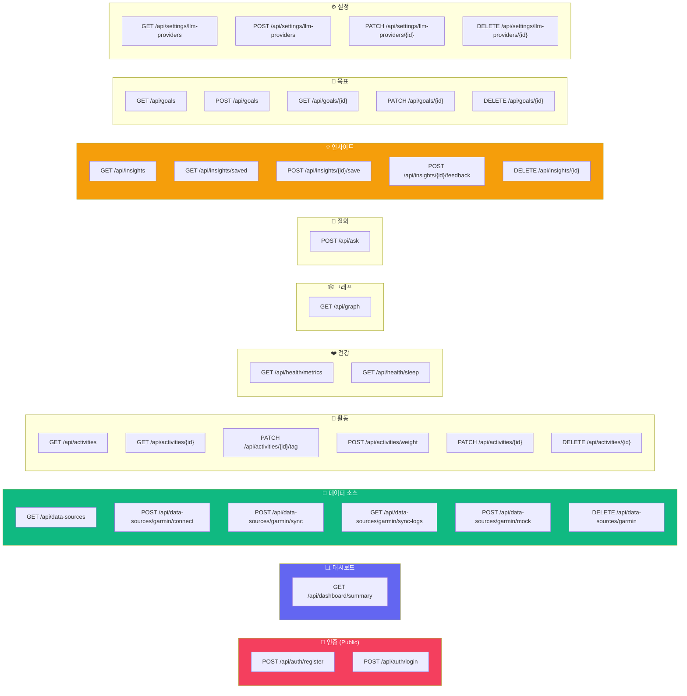

# 📡 API 명세

> 모든 API는 `ApiResponse<T>` 래퍼로 응답합니다.

```json
{
  "success": true,
  "message": null,
  "data": { ... }
}
```

**인증**: `Authorization: Bearer <jwt_token>`

---

## API 엔드포인트 맵



---

## 상세 명세

### 🔐 Auth API

| 메서드 | 엔드포인트 | 설명 | 인증 |
|--------|-----------|------|------|
| POST | `/api/auth/register` | 회원가입 | ❌ |
| POST | `/api/auth/login` | 로그인 | ❌ |
| POST | `/api/auth/refresh` | Access Token 갱신 (Refresh Token 쿠키 기반) | ❌ |
| POST | `/api/auth/logout` | 로그아웃 (서버측 Refresh Token 폐기) | ✅ |
| GET | `/api/auth/me` | 내 정보 조회 | ✅ |
| GET | `/api/auth/api-keys` | API 키 목록 조회 | ✅ |
| POST | `/api/auth/api-keys` | API 키 발급 | ✅ |
| DELETE | `/api/auth/api-keys/{id}` | API 키 삭제 | ✅ |

**로그인 요청**
```json
POST /api/auth/login
{
  "email": "user@example.com",
  "password": "password123"
}
```

**로그인 응답**
```json
{
  "success": true,
  "data": {
    "token": "eyJhbGciOiJIUzI1NiJ9...",
    "user": {
      "id": 1,
      "email": "user@example.com",
      "displayName": "User"
    }
  }
}
```
> **Set-Cookie**: `refresh_token=<jwt_refresh_token>; HttpOnly; Secure; SameSite=Strict; Max-Age=604800`
>
> Refresh Token은 응답 body가 아닌 **HttpOnly Cookie**로 전달된다.

**Refresh 요청**
```
POST /api/auth/refresh
Cookie: refresh_token=...
```
> `credentials: include`로 호출 시 쿠키가 자동 전송된다.

**Refresh 응답**
```json
{
  "success": true,
  "data": {
    "token": "eyJhbGciOiJIUzI1NiJ9...",
    "user": { ... }
  }
}
```
> **Set-Cookie**: 새로운 `refresh_token` 쿠키 (Rotation 적용 — 기존 토큰 폐지 후 재발급)

**Logout 요청**
```
POST /api/auth/logout
Authorization: Bearer <access_token>
Cookie: refresh_token=...
```

**Logout 응답**
```json
{
  "success": true,
  "data": null
}
```
> **Set-Cookie**: `refresh_token=; Max-Age=0` (쿠키 만료)

**API 키 발급 요청**
```json
POST /api/auth/api-keys
{
  "name": "내 노트북 Kimi"
}
```

**API 키 발급 응답** (생성 시에만 `key` 필드 포함)
```json
{
  "success": true,
  "data": {
    "id": 1,
    "name": "내 노트북 Kimi",
    "key": "pios_xxxxxxxxxxxxxxxx",
    "createdAt": "2026-05-13T10:00:00"
  }
}
```

---

### 📊 Dashboard API

| 메서드 | 엔드포인트 | 설명 |
|--------|-----------|------|
| GET | `/api/dashboard/summary` | 대시보드 요약 데이터 |

**응답 예시**
```json
{
  "latestHealth": { "restingHeartRate": 58, "stressAvg": 32.5, "weightKg": 72.5, ... },
  "latestSleep": { "sleepScore": 78, "totalSleepSeconds": 25200, ... },
  "latestActivity": { "activityType": "RUNNING", "distanceMeters": 8200, ... },
  "totalActivities": 42,
  "last7DaysHealth": [...],
  "last7DaysActivities": [...],
  "recentInsights": [...],
  "suggestedQuestions": [
    "최근 컨디션이 안 좋은 이유는?",
    "이번 주 훈련 강도는 적절해?",
    "러닝 기록이 좋았던 날들의 공통점은?"
  ]
}
```

---

### 📡 Data Sources API

| 메서드 | 엔드포인트 | 설명 |
|--------|-----------|------|
| GET | `/api/data-sources` | 연결된 데이터 소스 목록 |
| POST | `/api/data-sources/garmin/connect` | Garmin 계정 연결 |
| POST | `/api/data-sources/garmin/sync` | Garmin 데이터 동기화 — 활동, 건강지표, 수면, **체중** 포함 (body: syncType, dateFrom, dateTo) |
| GET | `/api/data-sources/garmin/sync-logs` | 동기화 이력 조회 |
| POST | `/api/data-sources/garmin/mock` | Mock 데이터 생성 |
| DELETE | `/api/data-sources/garmin` | Garmin 연결 해제 |

---

### 🏃 Activities API

| 메서드 | 엔드포인트 | 설명 |
|--------|-----------|------|
| GET | `/api/activities?page=&size=&activityType=&userTag=&activityName=&startTimeFrom=&startTimeTo=&minDistance=&maxDistance=&sortBy=&sortDir=` | 활동 목록 (페이징 + 필터 + 정렬) |
| GET | `/api/activities/{id}` | 활동 상세 |
| GET | `/api/activities/{id}/laps` | 활동 구간(lap) 목록 |
| POST | `/api/activities/weight` | 웨이트 트레이닝 수동 등록 |
| PATCH | `/api/activities/{id}` | 수동 웨이트 트레이닝 수정 (MANUAL만) |
| DELETE | `/api/activities/{id}` | 수동 웨이트 트레이닝 삭제 (MANUAL만) |
| PATCH | `/api/activities/{id}/tag` | 태그 수정 |

**필터 파라미터**

| 파라미터 | 타입 | 설명 |
|----------|------|------|
| `page` | int | 페이지 번호 (0-based), 기본값 0 |
| `size` | int | 페이지 크기, 기본값 20 |
| `activityType` | string | 활동 타입 exact match (예: `running`) |
| `userTag` | string | 사용자 태그 exact match. 빈 문자열(`""`) = 태그 없음 조건 |
| `activityName` | string | 활동 이름 부분 검색 (case-insensitive LIKE) |
| `startTimeFrom` | date | 시작일 (`YYYY-MM-DD`) 이후 |
| `startTimeTo` | date | 종료일 (`YYYY-MM-DD`) 이전 |
| `minDistance` | decimal | 최소 거리 (m). 적용 시 거리가 null인 항목(웨이트)은 자동 제외 |
| `maxDistance` | decimal | 최대 거리 (m). 적용 시 거리가 null인 항목(웨이트)은 자동 제외 |
| `sortBy` | string | 정렬 기준: `startTime` \| `distance` \| `duration` \| `calories` |
| `sortDir` | string | 정렬 방향: `asc` \| `desc` |

**웨이트 트레이닝 등록 요청**
```json
POST /api/activities/weight
{
  "activityName": "가슴 운��",
  "startTime": "2026-05-02T19:00:00",
  "durationSeconds": 3600,
  "averageHeartRate": 125,
  "calories": 350,
  "bodyPart": "CHEST",
  "exercises": [
    {
      "name": "Bench Press",
      "sets": [
        { "reps": 10, "weightKg": 60, "durationSeconds": 45 },
        { "reps": 8, "weightKg": 70, "durationSeconds": 60 }
      ]
    }
  ]
}
```

**태그 수정 요청**
```json
PATCH /api/activities/123/tag
{
  "userTag": "5K / 레이스"
}
```

---

### 💬 Ask API (RAG v2)

| 메서드 | 엔드포인트 | 설명 |
|--------|-----------|------|
| POST | `/api/ask` | 자연어 질의 (개인 기준선 비교 기반) |

**요청**
```json
{
  "question": "최근 컨디션이 떨어진 이유가 뭐야?"
}
```

**응답**
```json
{
  "questionId": 1,
  "insightId": 5,
  "answer": "최근 HRV 저하와 수면 시간 감소가 함께 관찰됩니다.",
  "intent": "CONDITION",
  "period": {
    "start": "2026-06-14",
    "end": "2026-06-20",
    "baselineStart": "2026-05-17",
    "baselineEnd": "2026-06-13"
  },
  "confidence": {
    "score": 0.82,
    "level": "HIGH",
    "reasons": ["분석 기간 데이터 7일 확보", "28일 기준선 비교 가능"]
  },
  "evidences": [
    {
      "type": "HEALTH_METRIC",
      "label": "평균 HRV",
      "observation": "최근 7일 평균 42ms",
      "comparison": "기준선보다 12% 낮음",
      "currentValue": 42,
      "baselineValue": 48,
      "changeRate": -12,
      "unit": "ms",
      "sourceId": 123,
      "sourceDate": "2026-06-19",
      "route": "/health?date=2026-06-19"
    }
  ],
  "followUpQuestions": [
    "수면과 HRV 변화를 날짜별로 비교해줘"
  ]
}
```

**특성**
- 질문의 기간("이번 주", "지난 주", "최근 N일/주", "최근 한 달")과 의도(CONDITION, SLEEP, TRAINING, PERFORMANCE, WORKOUT_SUMMARY, GENERAL)를 규칙 기반으로 판별
- 분석 기간은 기본 7일, 기준선은 직전 28일(명시적 기간은 동일 길이 기준선)로 설정되며 최대 90일로 제한
- 건강/수면/활동 지표의 평균·합계·변화율을 계산하여 신뢰도와 근거로 반환
- 신뢰도(score/level/reasons)는 서버가 데이터 커버리지(40%), 기준선 비교 가능 여부(30%), 질문-지표 관련성(30%)으로 산정
- OpenAI 키 미설정 또는 장애 시에도 동일한 구조의 규칙 기반 답변 반환

**특수 질문 — 운동 요약**

키워드: "이번주 운동", "운동 정리", "훈련 일지", "weekly summary" 등

- Garmin 활동은 랩(lap) 단위로, 수동 웨이트 트레이닝은 종목/세트 단위로 표 형태로 정리
- 마지막에 전체 주간 요약(총 활동 횟수, 총 거리, 총 볼륨 등) 추가

---

### 🕸️ Graph API

| 메서드 | 엔드포인트 | 설명 |
|--------|-----------|------|
| GET | `/api/graph?days=&view=&raceCategory=` | 개인 지식 그래프 데이터 |

### 🛠️ Admin API

| 메서드 | 엔드포인트 | 설명 |
|--------|-----------|------|
| POST | `/api/admin/backfill` | 그래프 투영 재실행 |
| POST | `/api/admin/backfill` | 그래프 투영 재실록 (관리자용) |

**응답**
```json
{
  "nodes": [
    { "id": "Person_1", "type": "Person", "label": "Me", "properties": {} },
    { "id": "123", "type": "Activity", "label": "Morning Run", "properties": {"type": "RUNNING"} },
    { "id": "456", "type": "Sleep", "label": "2026-04-28", "properties": {"score": 78} }
  ],
  "relationships": [
    { "id": "r_1", "type": "PERFORMED", "sourceId": "Person_1", "targetId": "123" },
    { "id": "r_2", "type": "HAS_SLEEP", "sourceId": "Person_1", "targetId": "456" }
  ]
}
```

---

### 💡 Insights API

| 메서드 | 엔드포인트 | 설명 |
|--------|-----------|------|
| GET | `/api/insights?category=&feedbackStatus=` | 인사이트 목록 (필터 가능) |
| GET | `/api/insights/saved` | 저장된 인사이트 |
| GET | `/api/insights/{id}` | 인사이트 상세 |
| POST | `/api/insights/{id}/save` | 인사이트 저장 |
| POST | `/api/insights/{id}/feedback` | 피드백 등록 |
| DELETE | `/api/insights/{id}` | 인사이트 삭제 |

**피드백 요청**
```json
{
  "feedbackStatus": "CORRECT"
}
```

---

### 💰 Finance API

| 메서드 | 엔드포인트 | 설명 |
|--------|-----------|------|
| GET | `/api/finance/cycles` | 월급일 기준 finance cycle 목록 |
| GET | `/api/finance/transactions?cycleId=` | cycle별 지출/수입 거래 목록. `transaction_at ASC, id ASC` 시간순 정렬 |
| PATCH | `/api/finance/transactions/{id}/time` | 거래 날짜는 유지하고 정렬/분석용 시각만 `HH:mm`으로 보정 |
| POST | `/api/finance/import/preview` | 앱 export `.xlsx` 파일 preview. `multipart/form-data`의 `file` 사용 |
| POST | `/api/finance/import/confirm` | preview 결과를 사용자 결정값과 함께 확정 저장 |
| GET | `/api/finance/accounts?cycleId=` | 계좌/지갑/부채/목적자금 목록과 cycle 내 현금흐름 요약 |
| POST | `/api/finance/accounts` | 계좌 생성. `aliases`로 import 원본 `asset` 값을 매핑 |
| PATCH | `/api/finance/accounts/{id}` | 계좌 이름, 타입, 역할, alias 수정 및 기존 거래 재매핑 |
| DELETE | `/api/finance/accounts/{id}` | 계좌 삭제. 연결 거래의 `account_id`는 해제 |
| POST | `/api/finance/accounts/auto-map` | 기존 계좌 name/alias 기준으로 미연결 거래 일괄 매핑 |
| GET | `/api/finance/recurring-bills` | 통신비 등 반복 청구 템플릿 목록 |
| POST | `/api/finance/recurring-bills` | 반복 청구 템플릿 생성 |
| POST | `/api/finance/recurring-bills/{id}/versions` | 대상 cycle부터 적용할 템플릿 버전 생성 |
| DELETE | `/api/finance/recurring-bills/{id}` | 반복 청구 템플릿 삭제 |

**Import preview 상태**

| 상태 | 의미 |
|------|------|
| `NEW` | 동일 fingerprint가 없고 중복 의심 조건도 없음 |
| `DUPLICATE` | `user_id + source_fingerprint`가 이미 존재 |
| `NEEDS_REVIEW` | 같은 날짜 + 같은 금액 + 같은 수입/지출이 있으나 fingerprint는 다름 |

**Import confirm 요청**
```json
{
  "importSessionId": "...",
  "decisions": [
    { "action": "create", "row": { "sourceFingerprint": "...", "status": "NEW" } },
    { "action": "skip", "row": { "sourceFingerprint": "...", "status": "NEEDS_REVIEW" } }
  ]
}
```

**거래 시간 보정 요청**
```json
{
  "time": "14:35"
}
```

시간 보정은 기존 `transaction_date`를 유지한 채 Asia/Seoul 기준 `transaction_at`의 시:분만 바꾼다. 초는 항상 `00`으로 저장하며, `timeAdjusted`, `timeAdjustedAt`으로 보정 여부를 표시한다. 원본 `sourceFingerprint`, `sourceRow`, `transactionDate`는 변경하지 않으므로 같은 엑셀 파일을 다시 import해도 기존 거래는 `DUPLICATE`로 분류된다.

**Finance account 매핑**

거래의 `asset`은 앱 export 원본값으로 보존하고, 사용자가 만든 계좌 마스터와 연결할 때만 `account_id`를 채운다. import confirm 시 `asset`이 기존 계좌 이름 또는 alias와 일치하면 자동 연결하고, 일치하지 않으면 Accounts 탭의 unmapped asset으로 노출한다. 계좌 생성/수정 시 alias가 추가되면 기존 거래도 같은 alias 기준으로 일괄 연결된다.

`수입/지출` 값이 `이체지출`인 거래는 `asset`을 출금 자산, `분류`를 입금처 자산명으로 해석한다. 소비분석에서는 제외하지만 Accounts의 cycle 흐름에서는 출금 계좌의 `cashOut`과 입금처 계좌의 `income`에 각각 반영한다.

계좌에는 기록 시작 전 잔액 보정을 위한 `openingBalance`, `openingBalanceDate`, `openingBalanceMemo`를 저장할 수 있다. 이 값은 거래/소비/수입으로 집계하지 않고, Accounts 응답의 `estimatedBalance = openingBalance + cycleNetFlow` 계산에만 사용한다.

계좌 타입은 `BANK_ACCOUNT`, `MOBILE_PAYMENT`, `SAVINGS_GOAL`, `DEBT`, `INTERNAL`, `OTHER`를 사용하고, 역할은 `SALARY`, `LIVING`, `SUBSCRIPTION`, `SINKING_FUND`, `DEBT_REPAYMENT`, `PAYMENT_METHOD`, `OTHER`를 사용한다.

피드백 상태: `CORRECT`, `UNCLEAR`, `WRONG`, `IMPORTANT`

**인사이트 응답의 근거(`evidences`)**

각 근거는 `evidenceSummary`(텍스트)와 `evidenceData`(구조화된 JSON)를 포함할 수 있습니다.

```json
{
  "id": 10,
  "evidenceType": "HEALTH_METRIC",
  "sourceTable": "garmin_daily_health_metrics",
  "sourceId": 123,
  "evidenceSummary": "평균 HRV: 최근 7일 평균 42ms — 기준선보다 12% 낮음",
  "weight": 0.5,
  "evidenceData": {
    "metric": "평균 HRV",
    "currentValue": 42,
    "baselineValue": 48,
    "changeRate": -12,
    "unit": "ms",
    "date": "2026-06-19",
    "route": "/health?date=2026-06-19"
  }
}
```
