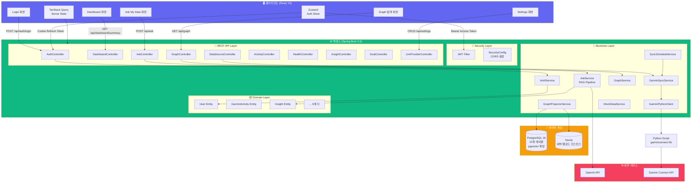
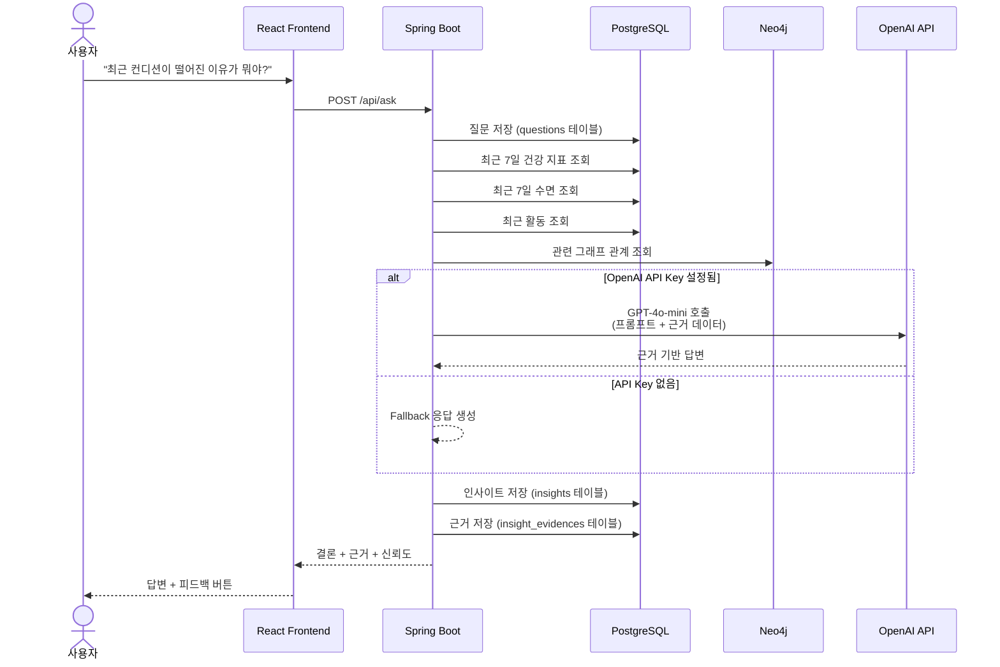
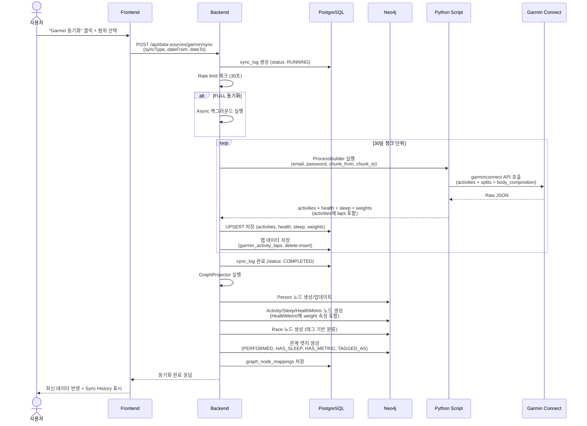
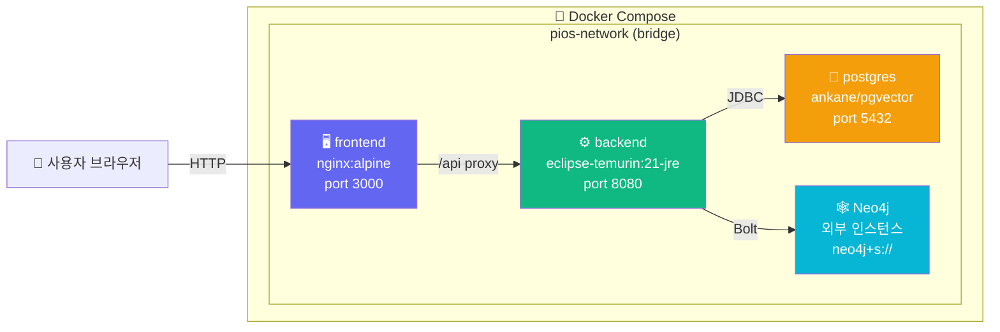

# 📐 아키텍처

## 전체 시스템 다이어그램



---

## 인증 흐름 (JWT + Refresh Token)

```mermaid
sequenceDiagram
    actor U as 사용자
    participant FE as React Frontend
    participant BE as Spring Boot
    participant PG as PostgreSQL

    U->>FE: 로그인 (email, password)
    FE->>BE: POST /api/auth/login
    BE->>PG: Refresh Token SHA-256 hash 저장
    BE-->>FE: Access Token (json) + Refresh Token (HttpOnly Cookie)
    FE->>FE: Zustand에 access token 저장

    U->>FE: API 호출
    FE->>BE: Authorization: Bearer <access>
    BE-->>FE: 200 OK

    alt Access Token 만료 (401)
        FE->>BE: POST /api/auth/refresh (withCredentials)
        BE->>BE: Cookie의 refresh_token 검증
        BE->>PG: 기존 Refresh Token 삭제 (Rotation)
        BE->>PG: 새 Refresh Token 저장
        BE-->>FE: 새 Access Token + 새 Refresh Token Cookie
        FE->>BE: 원래 요청 재시도
    end

    U->>FE: 로그아웃
    FE->>BE: POST /api/auth/logout
    BE->>PG: 해당 사용자 Refresh Token 전부 삭제
    BE-->>FE: Set-Cookie: refresh_token=; Max-Age=0
    FE->>FE: Zustand 상태 초기화
```

| 구성 요소 | 설명 |
|-----------|------|
| **Access Token** | JWT (HS256), 만료 24h, `Authorization: Bearer` 헤더로 전송 |
| **Refresh Token** | JWT (HS256), 만료 7일, `HttpOnly; Secure; SameSite=Strict` 쿠키로 저장 |
| **Rotation** | Refresh 시 기존 토큰 DB에서 삭제 후 새로 발급 (재사용 공격 방지) |
| **Revoke** | 로그아웃 시 DB에서 해당 사용자의 모든 refresh token 삭제 |
| **Silent Refresh** | 프론트에서 401 수신 시 `/api/auth/refresh` 자동 호출, 성공하면 대기 중인 요청 재시도 |

---

## 데이터 흐름 (RAG 파이프라인)



---

## 데이터 동기화 흐름



---

## 배포 아키텍처 (Docker Compose)



| 서비스 | 이미지 | 포트 | 역할 |
|--------|--------|------|------|
| frontend | nginx:alpine | 3000 | React 빌드 결과물 정적 서빙 |
| backend | eclipse-temurin:21-jre | 8080 | Spring Boot 애플리케이션 |
| postgres | ankane/pgvector | 5432 | 원천 데이터 + 벡터 저장 |
| caddy | caddy:2-alpine | 80/443 | 리버스 프록시 + 자동 HTTPS |
