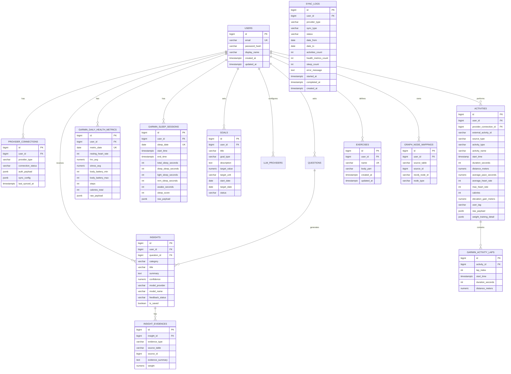
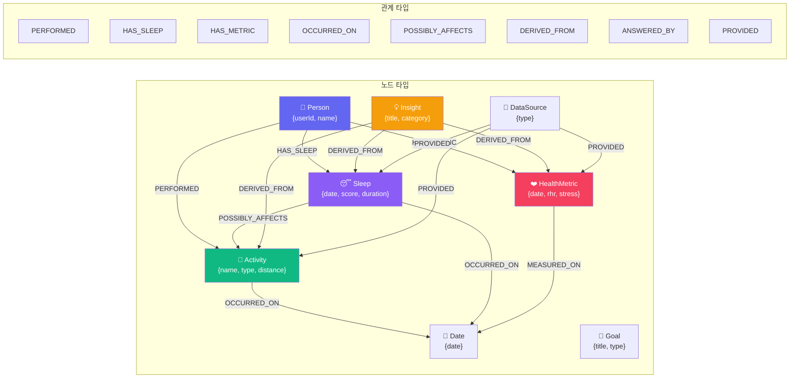

# 🗄️ 데이터베이스 스키마

## ERD (Entity Relationship Diagram)



---

## 테이블 요약

| # | 테이블 | 설명 | 레코드 수 예상 |
|---|--------|------|---------------|
| 1 | `users` | 서비스 사용자 | 1~N |
| 2 | `provider_connections` | 외부 데이터 소스 연결 정보 + 동기화 설정 | 1~5 / 사용자 |
| 3 | `activities` | 운등 기록 (Garmin + 수동 입력). 날씨 정보(온도/습도/풍속/상태) 포함 | 100~500 / 사용자/년 |
| 4 | `garmin_activity_laps` | 운등 랩(구간) 기록 | 500~2000 / 사용자/년 |
| 5 | `garmin_daily_health_metrics` | 일일 건강 지표 | 365 / 사용자/년 |
| 6 | `garmin_sleep_sessions` | 수면 기록 | 365 / 사용자/년 |
| 7 | `goals` | 사용자 목표 | 5~20 / 사용자 |
| 8 | `llm_providers` | LLM Provider 설정 | 1~3 / 사용자 |
| 9 | `questions` | 사용자 질문 이력 | 50~200 / 사용자 |
| 10 | `insights` | 생성된 인사이트 | 100~500 / 사용자 |
| 11 | `insight_evidences` | 인사이트 근거 데이터 | 3~10 / 인사이트 |
| 12 | `graph_node_mappings` | PostgreSQL-Neo4j 매핑 | 1000~5000 / 사용자 |
| 13 | `sync_logs` | 동기화 이력 (상태, 기간, 레코드 수, 에러) | 100~500 / 사용자 |
| 14 | `exercises` | 사용자 정의 웨이트 트레이닝 종목 | 20~100 / 사용자 |
| 15 | `refresh_tokens` | Refresh Token 저장 (SHA-256 hash, rotation/ revoke 지원) | 1~3 / 사용자 |

---

## Neo4j 그래프 모델



### 관계 속성

| 속성 | 타입 | 설명 |
|------|------|------|
| `confidence` | float | 관계 신뢰도 (0~1) |
| `source` | string | SYSTEM_RULE / LLM_ANALYSIS / USER_CONFIRMED |
| `period_start` | date | 관계 분석 시작일 |
| `period_end` | date | 관계 분석 종료일 |
| `created_at` | datetime | 관계 생성 시각 |
| `reason` | string | 관계 생성 이유 |

---

## 설계 원칙

```text
1. Raw 데이터는 PostgreSQL에 저장
2. 의미 있는 요약 단위만 Neo4j에 저장
3. 초 단위 스트림은 노드화하지 않음
4. 일/활동/수면/인사이트 단위 중심으로 시작
5. 강한 인과관계(CAUSES) 대신 신중한 표현(POSSIBLY_AFFECTS) 사용
```
