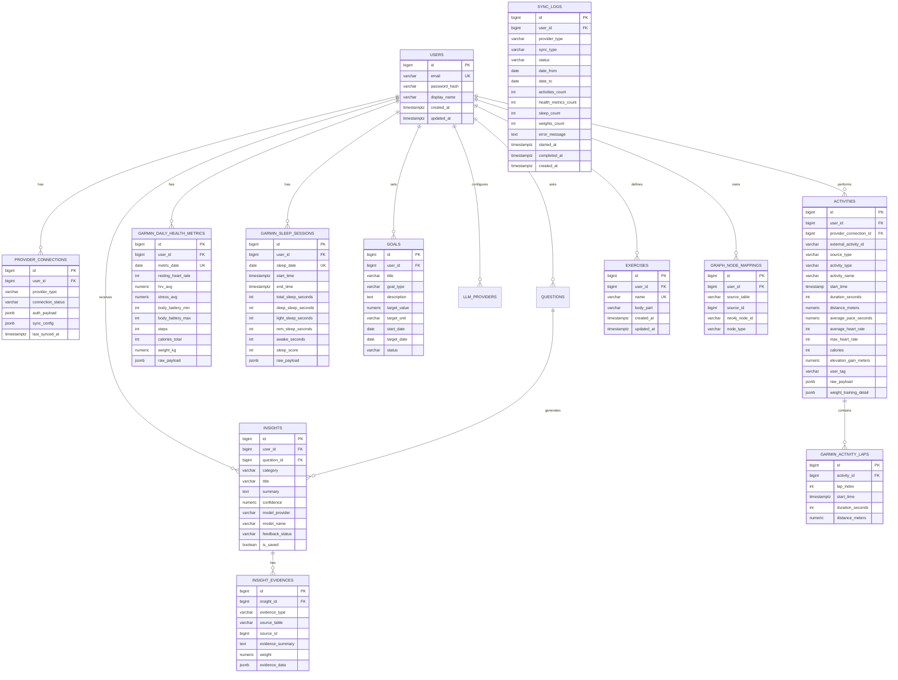
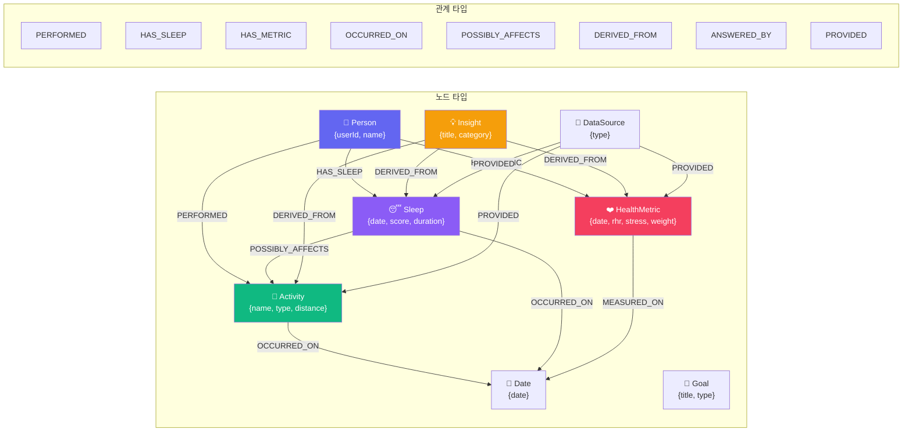

# 🗄️ 데이터베이스 스키마

## ERD (Entity Relationship Diagram)



---

## 테이블 요약

| # | 테이블 | 설명 | 레코드 수 예상 |
|---|--------|------|---------------|
| 1 | `users` | 서비스 사용자 | 1~N |
| 2 | `provider_connections` | 외부 데이터 소스 연결 정보 + 동기화 설정 | 1~5 / 사용자 |
| 3 | `activities` | 운등 기록 (Garmin + 수동 입력). 날씨 정보(온도/습도/풍속/상태) 포함 | 100~500 / 사용자/년 |
| 4 | `garmin_activity_laps` | 운등 랩(구간) 기록 | 500~2000 / 사용자/년 |
| 5 | `garmin_daily_health_metrics` | 일일 건강 지표 (체중 포함) | 365 / 사용자/년 |
| 6 | `garmin_sleep_sessions` | 수면 기록 | 365 / 사용자/년 |
| 7 | `goals` | 사용자 목표 | 5~20 / 사용자 |
| 8 | `llm_providers` | LLM Provider 설정 | 1~3 / 사용자 |
| 9 | `questions` | 사용자 질문 이력 | 50~200 / 사용자 |
| 10 | `insights` | 생성된 인사이트 | 100~500 / 사용자 |
| 11 | `insight_evidences` | 인사이트 근거 데이터 (텍스트 요약 + `evidence_data` JSONB) | 3~10 / 인사이트 |
| 12 | `graph_node_mappings` | PostgreSQL-Neo4j 매핑 | 1000~5000 / 사용자 |
| 13 | `sync_logs` | 동기화 이력 (상태, 기간, 레코드 수, 에러) | 100~500 / 사용자 |
| 14 | `exercises` | 사용자 정의 웨이트 트레이닝 종목 | 20~100 / 사용자 |
| 15 | `refresh_tokens` | Refresh Token 저장 (SHA-256 hash, rotation/ revoke 지원) | 1~3 / 사용자 |

### `insight_evidences.evidence_data` JSONB

RAG v2에서 생성된 근거는 텍스트 요약과 함께 구조화된 수치 데이터를 JSONB로 저장합니다.

```json
{
  "metric": "평균 HRV",
  "currentValue": 42,
  "baselineValue": 48,
  "changeRate": -12,
  "unit": "ms",
  "date": "2026-06-19",
  "route": "/health?date=2026-06-19"
}
```

| 필드 | 설명 |
|------|------|
| `metric` | 지표명 |
| `currentValue` | 분석 기간 평균/합계 값 |
| `baselineValue` | 기준선 기간 평균/합계 값 |
| `changeRate` | 변화율(%) |
| `unit` | 단위(ms, bpm, 시간, km, 회 등) |
| `date` | 근거의 대표 날짜 |
| `route` | 프론트엔드 라우트(활동 상세 또는 Health 화면) |

---

## Neo4j 그래프 모델



### 관계 속성

| 속성 | 타입 | 설명 |
|------|------|------|
| `confidence` | float | 관계 신뢰도 (0~1) |
| `source` | string | SYSTEM_RULE / LLM_ANALYSIS / USER_CONFIRMED |
| `period_start` | date | 관계 분석 시작일 |
| `period_end` | date | 관계 분석 종료일 |
| `created_at` | datetime | 관계 생성 시각 |
| `reason` | string | 관계 생성 이유 |

---

## 설계 원칙

```text
1. Raw 데이터는 PostgreSQL에 저장
2. 의미 있는 요약 단위만 Neo4j에 저장
3. 초 단위 스트림은 노드화하지 않음
4. 일/활동/수면/인사이트 단위 중심으로 시작
5. 강한 인과관계(CAUSES) 대신 신중한 표현(POSSIBLY_AFFECTS) 사용
```

---

## Finance 스키마

Finance 도메인은 PostgreSQL에 우선 저장하며, 이번 1차 구현에서는 Neo4j 투영 대상에서 제외한다.

| 테이블 | 설명 |
|--------|------|
| `finance_cycles` | 월급 입금 직후부터 다음 월급 직전까지의 분석 cycle |
| `finance_transactions` | 앱 export에서 import된 수입/지출 거래. `user_id + source_fingerprint`로 멱등성 보장. 원본 `asset`과 선택적 `account_id`를 함께 저장 |
| `finance_accounts` | 사용자가 정의한 계좌/지갑/목적자금/부채 마스터 |
| `finance_account_aliases` | import 원본 `asset` 값을 계좌에 연결하는 alias |
| `recurring_bill_templates` | KT 통신비 같은 반복 청구 프로필 |
| `recurring_bill_template_versions` | 특정 `effective_cycle_id`부터 적용되는 고정비 구성 버전 |
| `recurring_bill_template_items` | 월정액, 부가서비스, 할인, 부가세 등 버전별 상세 항목 |

`finance_transactions`는 현금흐름과 소비분석을 분리하기 위해 `cashflow_included`, `spending_included`, `cashflow_amount`, `spending_amount`를 별도로 가진다. 원본 `amount`는 청구/결제 row의 실제 금액으로 보존하고, 화면 합계는 분석용 금액을 사용한다. 예를 들어 통신비 납부액은 현금흐름에는 원 청구액으로 포함하고, 소비분석에는 같은 cycle의 `소액결제` 합계를 제외한 금액만 반영한다. 소액결제 원거래는 실제 소비 카테고리의 `spending_amount`로 포함한다.

엑셀 export의 년월일은 원본 날짜로 신뢰하고 `transaction_date`에 보존한다. 사용자가 Transactions 탭에서 시:분을 후보정하면 `transaction_at`만 변경하고 `time_adjusted`, `time_adjusted_at`을 기록한다. `source_fingerprint`와 `source_row`는 변경하지 않으므로 시간 보정 후에도 같은 원본 파일 재import는 멱등하게 `DUPLICATE`로 처리된다.

계좌 확장은 원본 보존과 분석용 매핑을 분리한다. `asset`은 export 원본 문자열로 유지하고, 사용자가 Accounts 탭에서 만든 `finance_accounts`와 일치하는 name/alias가 있을 때만 `account_id`를 채운다. 지원 계좌 타입은 `BANK_ACCOUNT`, `MOBILE_PAYMENT`, `SAVINGS_GOAL`, `DEBT`, `INTERNAL`, `OTHER`이며, 역할은 `SALARY`, `LIVING`, `SUBSCRIPTION`, `SINKING_FUND`, `DEBT_REPAYMENT`, `PAYMENT_METHOD`, `OTHER`이다.

`이체지출` 거래는 단일 원본 row로 저장하되, 계좌 흐름 계산 시 `asset`을 출금 계좌, `category`(`분류`)를 입금처 계좌 alias로 해석한다. 따라서 소비분석에는 포함하지 않고 계좌별 현금흐름에는 양방향으로 반영한다. Overview의 External Out은 이체를 제외한 외부 현금유출이고, Account Flow는 이체 입출금까지 포함한 실제 계좌별 흐름이다.

`finance_accounts.opening_balance`는 기록 시작 전부터 존재하던 계좌 잔액 보정값이다. 거래 row로 만들지 않고 `opening_balance_date`, `opening_balance_memo`와 함께 계좌 상태값으로 보존하며, 추정 잔액은 `opening_balance + cycleNetFlow`로 계산한다.
