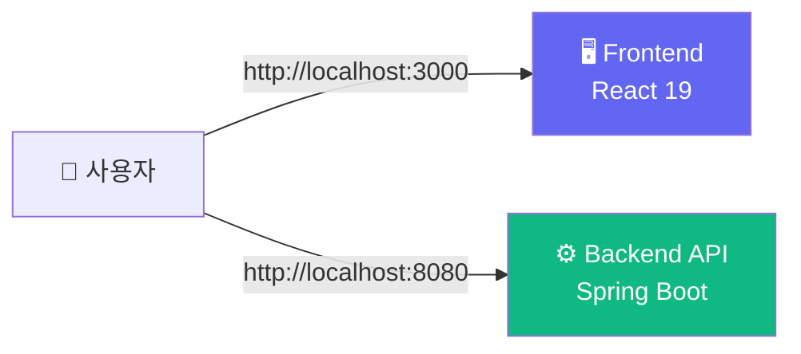
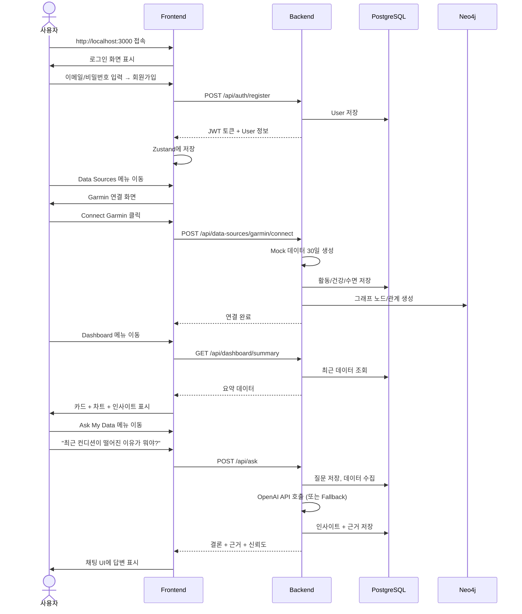

# 🚀 실행 가이드

## 사전 준비

| 항목 | 버전 | 확인 명령 |
|------|------|----------|
| Docker | 20.10+ | `docker --version` |
| Docker Compose | 2.0+ | `docker compose version` |
| (선택) OpenAI API Key | - | https://platform.openai.com |

---

## 빠른 시작 (3단계)

```bash
# 1. 프로젝트 폰더로 이동
cd /path/to/personal-insight-os

# 2. 환경변수 설정 (선택)
cp .env.example .env
# .env 파일을 열어 OPENAI_API_KEY를 입력하면 LLM 인사이트 활성화

# 3. 전체 서비스 빌드 & 실행
docker-compose up --build
```

---

## 서비스 접속



| 서비스 | URL | 기본 계정 |
|--------|-----|----------|
| 웹 앱 | http://localhost:3000 | 회원가입 후 사용 |
| Backend API | http://localhost:8080 | JWT Bearer 필요 |
| PostgreSQL | localhost:5432 | pios / pios123 |

---

## 첫 사용 흐름



---

## 개발 모드 (Frontend Only)

```bash
cd frontend
npm install
npm run dev
# http://localhost:5173
```

## 개발 모드 (Backend Only)

```bash
cd backend
# Maven 래퍼가 없으면 수동 설치
mvn spring-boot:run
# http://localhost:8080
```

---

## Docker Compose 서비스 상세

```yaml
# docker-compose.yml 개요

services:
  postgres:          # 원천 데이터 저장
    image: ankane/pgvector
    ports: 5432:5432
    volumes: postgres_data

  backend:           # Spring Boot API
    build: ./backend
    ports: 8080:8080
    depends_on: [postgres, neo4j]

  frontend:          # React + nginx
    build: ./frontend
    ports: 3000:80
    depends_on: [backend]
```

---

## 문제 해결

| 증상 | 원인 | 해결 |
|------|------|------|
| `frontend builder failed` | TypeScript 타입 에러 | `tsconfig.json` 확인 |
| `backend builder failed` | Java 컴파일 에러 | `var` → 명시적 타입 변경 |
| `Connection refused` | DB 아직 준비 안 됨 | `depends_on` healthcheck 대기 |
| `401 Unauthorized` | JWT 만료/누락 | 로그아웃 후 재로그인 |
| `LLM 응답 없음` | OpenAI API Key 미설정 | `.env`에 `OPENAI_API_KEY` 추가 |

---

## 환경변수

```bash
# .env 파일 예시
OPENAI_API_KEY=sk-your-openai-key-here
JWT_SECRET=your-secret-key-change-in-production

# Neo4j Cloud (또는 외부 인스턴스)
NEO4J_URI=neo4j+s://xxxxx.databases.neo4j.io
NEO4J_USERNAME=neo4j
NEO4J_PASSWORD=your-neo4j-password
```

| 변수 | 기본값 | 설명 |
|------|--------|------|
| `OPENAI_API_KEY` | (없음) | OpenAI API 호출용 (선택) |
| `JWT_SECRET` | `pios-jwt-secret-key...` | JWT 서명 키 |
| `SPRING_DATASOURCE_URL` | `jdbc:postgresql://postgres:5432/pios` | PostgreSQL 연결 |
| `NEO4J_URI` | (없음) | Neo4j 접속 URI |
| `NEO4J_USERNAME` | (없음) | Neo4j 사용자명 |
| `NEO4J_PASSWORD` | (없음) | Neo4j 비밀번호 |
