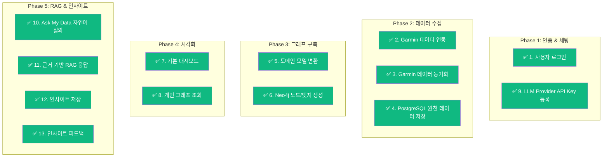
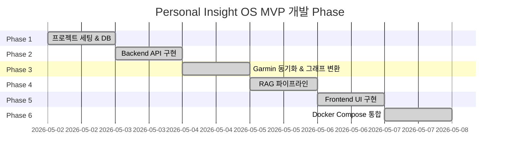

# 📋 MVP 기능 체크리스트

> 기획 문서에 정의된 13개 MVP 기능의 구현 상세

---

## 기능별 구현 현황



---

## ✅ 1. 사용자 로그인 (JWT 인증)

| 항목 | 내용 |
|------|------|
| **구현 위치** | `AuthController`, `AuthService`, `JwtUtil`, `SecurityConfig` |
| **기술** | Spring Security + JJWT 0.12.5 |
| **인증 방식** | Stateless JWT (Bearer Token) |
| **지원 기능** | 회원가입, 로그인, 내 정보 조회 |
| **Frontend 연동** | Zustand authStore + persist (localStorage) |

```java
// JwtUtil.java
public String generateToken(Long userId, String email) {
    return Jwts.builder()
        .subject(String.valueOf(userId))
        .claim("email", email)
        .expiration(new Date(now.getTime() + expiration))
        .signWith(getSigningKey())
        .compact();
}
```

---

## ✅ 2. Garmin 데이터 연동

| 항목 | 내용 |
|------|------|
| **구현 위치** | `DataSourceController`, `DataSourceService` |
| **화면** | `/data-sources` |
| **기능** | Garmin 계정 연결 (email/password 저장) |
| **동기화 설정** | `sync_config` JSONB (full_sync_from, last_sync_date, sync_range_days, auto_sync_enabled, auto_sync_cron) |

```java
// DataSourceService.java
public ProviderConnectionDto connectGarmin(Long userId, String email, String password) {
    conn.setConnectionStatus("CONNECTED");
    conn.setAuthPayload(Map.of("email", email, "password", password));
    conn.setSyncConfig(Map.of("sync_range_days", 7, "auto_sync_enabled", true, ...));
    return toDto(conn);
}
```

---

## ✅ 3. Garmin 데이터 동기화

| 항목 | 내용 |
|------|------|
| **구현 위치** | `GarminSyncService`, `GarminPythonClient`, `SyncScheduleService`, `DataSourceService` |
| **동기화 방식** | ProcessBuilder → Python `garminconnect` 라이브러리 → Garmin Connect API |
| **동기화 유형** | FULL (최초/전체), INCREMENTAL (수동/자동 증분), MANUAL |
| **Rate Limit** | 동일 사용자 기준 최소 30초 간격 |
| **청크 처리** | 30일 단위 청크 순차 처리 |
| **백그라운드** | FULL 동기화는 `@Async("syncTaskExecutor")`로 비동기 실행 |
| **자동 동기화** | Spring Scheduler, 매일 새벽 3시 (`auto_sync_enabled` 체크) |
| **중복 처리** | PostgreSQL `ON CONFLICT ... DO UPDATE` (UPSERT) |
| **동기화 이력** | `sync_logs` 테이블에 상태/기간/레코드 수/에러 저장 |
| **수면 단계** | deep / light / rem / awake — Stacked Bar Chart로 비중 시각화 |
| **Mock 데이터** | `MockDataService.generateMockData()` — 개발/테스트용 별도 유지 |

```java
// GarminSyncService.java
public void sync(Long userId, SyncType type, LocalDate from, LocalDate to) {
    checkRateLimit(userId);                    // 30초 제한
    SyncLog log = createSyncLog(...);          // PENDING → RUNNING
    List<DateRange> chunks = splitIntoChunks(from, to, 30);
    for (DateRange chunk : chunks) {
        SyncResult result = pythonClient.fetch(email, password, chunk.from, chunk.to, ALL);
        saveActivities(userId, result.data().get("activities"));
        saveHealthMetrics(userId, result.data().get("health"));
        saveSleepSessions(userId, result.data().get("sleep"));
    }
    markCompleted(log, counts);                // COMPLETED
    graphProjector.projectUserData(userId);    // Neo4j 투영
}
```

---

## ✅ 4. PostgreSQL 원천 데이터 저장

| 항목 | 내용 |
|------|------|
| **구현 위치** | `V1__init.sql`, 12개 Entity, 11개 Repository |
| **테이블** | users, provider_connections, garmin_activities, garmin_activity_laps, garmin_daily_health_metrics, garmin_sleep_sessions, goals, llm_providers, questions, insights, insight_evidences, graph_node_mappings, sync_logs |
| **특징** | `jsonb` Raw 저장 + 정규화 컬럼 + Flyway 마이그레이션 |

```sql
-- garmin_activities (예시)
CREATE TABLE garmin_activities (
    id BIGSERIAL PRIMARY KEY,
    user_id BIGINT NOT NULL REFERENCES users(id),
    garmin_activity_id VARCHAR(100) NOT NULL,
    activity_type VARCHAR(50),
    raw_payload JSONB NOT NULL DEFAULT '{}',
    ...
    UNIQUE (user_id, garmin_activity_id)
);
```

---

## ✅ 5. 도메인 모델 변환

| 항목 | 내용 |
|------|------|
| **구현 위치** | `GarminActivity` → `ActivityDto`, Entity ↔ DTO 변환 |
| **서비스** | `ActivityService`, `HealthService`, `DashboardService` |
| **변환 흐름** | PostgreSQL Entity → Service DTO 변환 → Controller 응답 |

---

## ✅ 6. Neo4j 노드/엣지 생성

| 항목 | 내용 |
|------|------|
| **구현 위치** | `GraphProjectorService` |
| **동작** | PostgreSQL 데이터 읽기 → Neo4j Cypher 실행 → 노드/관계 생성 → 매핑 저장 |
| **생성 노드** | Person, Activity, Sleep, HealthMetric, Race |
| **생성 관계** | PERFORMED, HAS_SLEEP, HAS_METRIC, TAGGED_AS (Activity→Race) |
| **Race 노드** | `userTag` 기반 분류 노드. 속성: `name`, `category` (5K/10K/하프/풀/custom) |
| **동기화** | 태그 수정 시 `updateActivityTag()`로 Neo4j 증분 업데이트 |

```java
// GraphProjectorService.java
session.run("""
    MERGE (n:Activity {sourceId: $sourceId, userId: $userId})
    SET n.name = $name, n.type = $type
    WITH n
    MATCH (p:Person {userId: $userId})
    MERGE (p)-[:PERFORMED]->(n)
""", params);
```

---

## ✅ 7. 활동 목록 조회 (필터 + 페이징)

| 항목 | 내용 |
|------|------|
| **구현 위치** | `ActivityController`, `ActivityService`, `ActivitySpecification`, `Activities.tsx` |
| **필터 조건** | 타입(`activityType`), 태그(`userTag` / 태그 없음), 이름(`LIKE`), 기간(`startTimeFrom` / `startTimeTo`), 거리 범위(`minDistance` / `maxDistance`) |
| **정렬** | `startTime` / `distance` / `duration` / `calories` × `asc` / `desc` |
| **백엔드** | JPA Specification 동적 쿼리 (`ActivitySpecification.withFilter()`) |
| **프론트엔드** | native `<select>` + shadcn `Input` 필터바, `Button` 이전/다음 페이징 |
| **태그 관리** | 인라인 드롭다운으로 5K/10K/하프/풀 프리셋 태그 또는 직접 입력 |
| **수동 입력** | 웨이트 트레이닝 전용 수동 등록/수정/삭제. 거리 없음. 세트/반복/무게/시간 JSONB 저장. 기존 종목명 선택 또는 신규 입력 |
| **러닝 상세 / 스플릿 복사** | 러닝 타입 행 클릭 → shadcn/ui Dialog로 활동 요약(거리/시간/페이스/심박/칼로리) + Lap 테이블 표시. "Copy as Text" 버튼으로 보기 좋은 텍스트 형식을 클립보드에 복사 |
| **주간 회고 복사 (옵시디언)** | Dashboard의 "Copy Weekly Report" 버튼 → 최근 7일 건강 지표 + 수면 + 활동 목록(러닝/웨이트)을 마크다운 테이블 형식으로 클립보드 복사. 옵시디언 주간 회고에 그대로 붙여넣기 가능 |
| **거리 필터 호환** | 거리 범위 필터 적용 시 `distance_meters IS NOT NULL` 조건으로 웨이트 자동 제외 |

---

## ✅ 8. 기본 대시보드

| 항목 | 내용 |
|------|------|
| **구현 위치** | `DashboardController`, `DashboardService`, `Dashboard.tsx` |
| **구성** | 4개 요약 카드 + 7일 트렌드 차트 + 인사이트 + 빠른 질문 |
| **차트** | Recharts AreaChart (RHR + Stress) |
| **라우트** | `/` (홈) |

```tsx
// Dashboard.tsx
const { data } = useQuery({
    queryKey: ['dashboard'],
    queryFn: api.dashboard.summary,
});
```

---

## ✅ 9. 개인 그래프 조회

| 항목 | 내용 |
|------|------|
| **구현 위치** | `GraphController`, `GraphService`, `Graph.tsx` |
| **라이브러리** | `cytoscape` + `cytoscape-fcose` |
| **필터** | 날짜(7/14/30/전체), 뷰(활동/컨디션/통합), 레이스 카테고리 |
| **구성** | Cytoscape 캔버스 + 필터 패널(노드/관계 타입 토글) + 상단 필터 바 |
| **필터** | 날짜(7/14/30/전체), 뷰(활동/컨디션/통합), 레이스 카테고리 |
| **필터** | 날짜(7/14/30/전체), 뷰(활동/컨디션/통합), 레이스 카테고리(5K/10K/하프/풀/커스텀) |
| **노드 색상** | Person(Indigo), Activity(Emerald), Sleep(Purple), HealthMetric(Rose) |

```tsx
// Graph.tsx
const { data } = useQuery({
    queryKey: ['graph', days, view, raceCategory],
    queryFn: () => api.graph.get(days, view, raceCategory),
});
```

---

## ✅ 10. LLM Provider API Key 등록

| 항목 | 내용 |
|------|------|
| **구현 위치** | `LlmProviderController`, `LlmProviderService`, `Settings.tsx` |
| **지원 Provider** | OpenAI, Anthropic, Google Gemini |
| **저장 필드** | providerName, apiKeyEncrypted, defaultChatModel, embeddingModel, enabled, monthlyBudgetLimit |
| **화면** | `/settings` |

---

## ✅ 11. Ask My Data 자연어 질의

| 항목 | 내용 |
|------|------|
| **구현 위치** | `AskController`, `AskService`, `Ask.tsx` |
| **화면** | `/ask` |
| **UI** | 채팅 UI + 샘플 질문 버튼 + 메시지 히스토리 |
| **샘플 질문** | "최근 컨디션이 떨어진 이유가 뭐야?", "러닝 기록이 좋았던 날들의 공통점은?" 등 |

---

## ✅ 12. 근거 기반 RAG 응답

| 항목 | 내용 |
|------|------|
| **구현 위치** | `AskService.ask()` |
| **파이프라인** | 질문 저장 → 데이터 수집(PostgreSQL) → **태그 키워드 retrieval** → 관계 조회(Neo4j) → LLM 호출 → 근거 수집 → 응답 생성 |
| **활동 데이터** | 이름/날짜/타입/거리/시간/태그를 LLM 프롬프트에 상세 직렬화하여 주입 |
| **태그 기반 retrieval** | "5K/10K/하프/풀" 키워드 감지 → `userTag` exact match 조회 → 결과를 프롬프트 상단에 주입 |
| **환각 방지 원칙** | Evidence-first, 근거 없는 답변 금지, 인과관계 단정 금지, 신뢰도 표시 |
| **Fallback** | OpenAI API Key 미설정 시에도 기본 응답 제공 |

```java
// AskService.java
private String callLlm(String question, List<?> health, List<?> sleep, List<?> activities) {
    // systemPrompt: 환각 방지 규칙 6가지
    // userPrompt: 질문 + 데이터 요약
    // OpenAI API 호출 또는 Fallback
}
```

**응답 구조**
```json
{
  "conclusion": "...",
  "evidenceSummary": ["최근 7일 데이터 기준", "건강 지표 7일", ...],
  "confidence": "중간",
  "followUpQuestion": "..."
}
```

---

## ✅ 13. AI 운등 요약 (Ask My Data 확장)

| 항목 | 내용 |
|------|------|
| **구현 위치** | `AskService` |
| **키워드** | "이번주 운등", "운등 정리", "훈련 일지", "weekly summary" |
| **동작** | 최근 7일 활동 수집 → Garmin 랩 테이블 + 웨이트 세트 테이블 포맷팅 → LLM 프롬프트 주입 |
| **출력** | 날짜별 활동 요약(랩/세트 표) + 주간 총평 |

---

## ✅ 14. 인사이트 저장

| 항목 | 내용 |
|------|------|
| **구현 위치** | `InsightController.save()`, `Insights.tsx` |
| **기능** | 답변을 인사이트로 저장 (is_saved = true) |
| **저장 위치** | `insights` 테이블 + `insight_evidences` 테이블 |
| **UI** | 저장 버튼 (💾), 저장된 인사이트 필터 |

---

## ✅ 14. 인사이트 피드백

| 항목 | 내용 |
|------|------|
| **구현 위치** | `InsightController.feedback()`, `Ask.tsx`, `Insights.tsx` |
| **피드백 상태** | `CORRECT` (맞음), `UNCLEAR` (애매함), `WRONG` (틀림), `IMPORTANT` (중요함) |
| **UI** | 👍 / ❓ / 👎 / 💾 버튼 |
| **향후 활용** | 피드백 기반 인사이트 개선 (MVP 이후) |

---

## MVP 판단 기준 달성 여부

| 기준 | 달성 |
|------|------|
| Garmin 데이터를 수집해서 내 운등/수면/건강 지표를 조회할 수 있는가? | ✅ |
| 수집된 데이터를 Activity, Sleep, HealthMetric 등 도메인으로 변환할 수 있는가? | ✅ |
| PostgreSQL에는 원천/정형 데이터를 저장하고, Neo4j에는 의미 있는 관계를 저장할 수 있는가? | ✅ |
| 사용자가 자연어로 질문했을 때, 실제 데이터 근거를 기반으로 답변할 수 있는가? | ✅ |
| 생성된 인사이트를 저장하고, 사용자가 맞음/틀림/애매함으로 피드백할 수 있는가? | ✅ |

---

## Phase별 개발 로드맵


