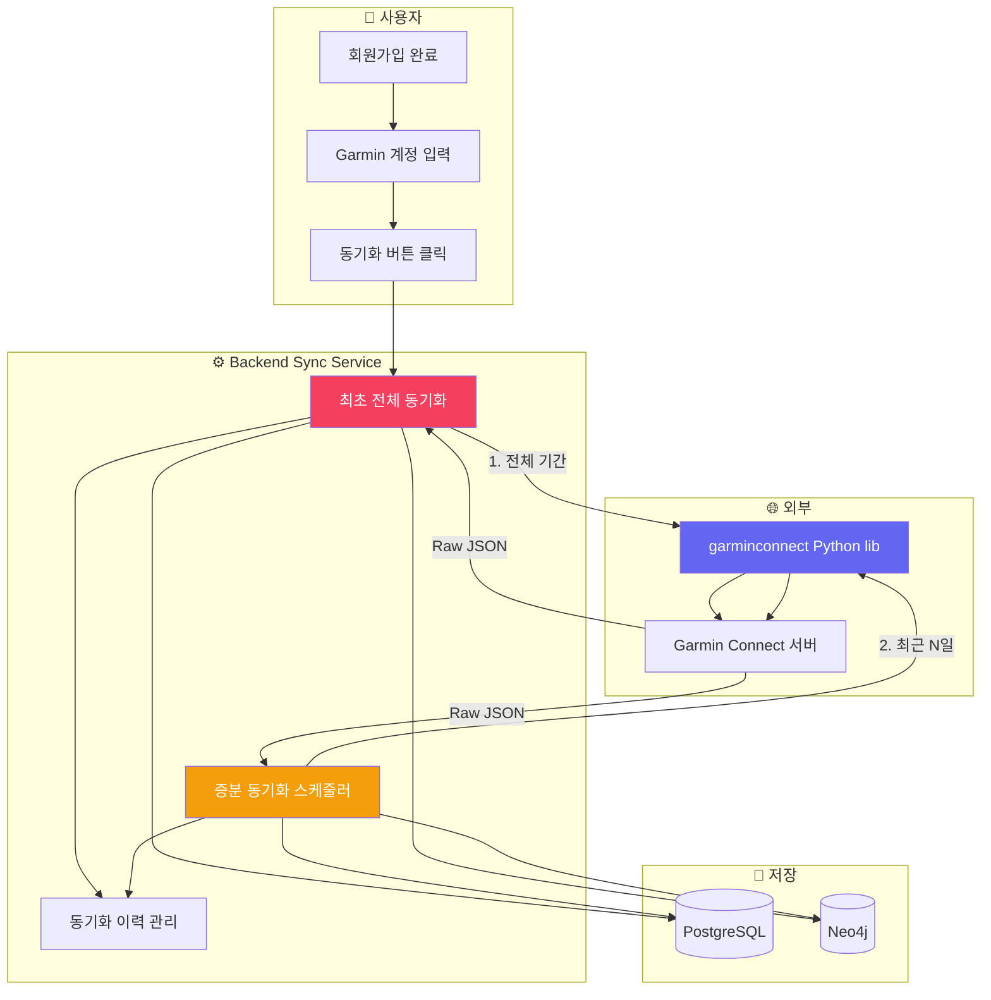
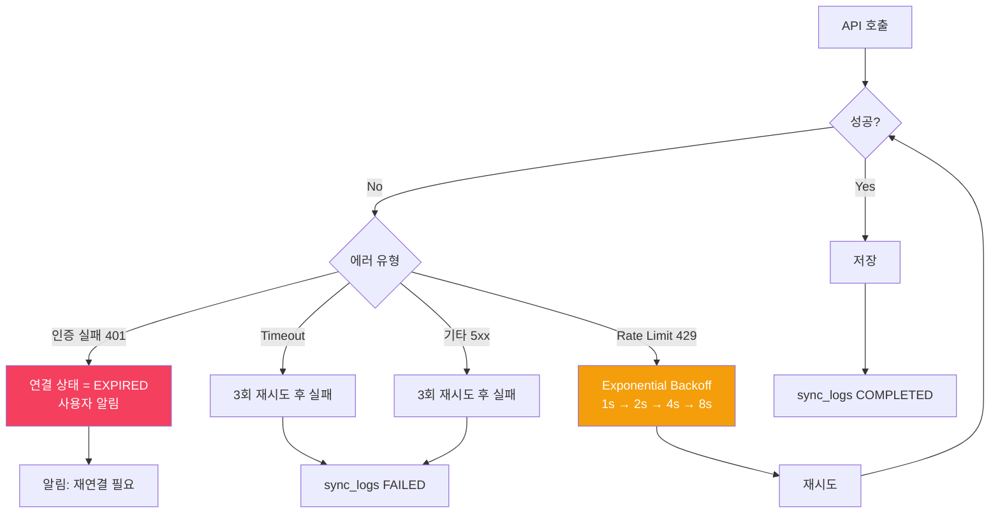

# 구상: 실제 Garmin 데이터 동기화 로직

> 현재는 Mock 데이터 생성. 실제 garminconnect 라이브러리 연동을 위한 설계안.

---

## 1. 전체 흐름



---

## 2. 동기화 종류

| 종류 | 시점 | 대상 기간 | 특징 |
|------|------|----------|------|
| **최초 전체 동기화** | 회원가입 후 첫 연결 시 | 전체 (기본: 가입일~오늘, 최대 2년) | 오래 걸림 (수 분~수십 분), 백그라운드 처리 |
| **수동 동기화** | 사용자가 버튼 클릭 | 최근 7일 또는 30일 (설정 가능) | 즉시 실행, 로딩 상태 표시 |
| **스케줄 동기화** | 매일 새벽 3시 (예정) | 전날 데이터 | Quartz / Spring Scheduler, 사용자 On/Off 가능 |
| **실시간 동기화** | - | - | **아래에서 옵션별 검토** |

---

## 3. 최초 전체 동기화 상세

### 3-1. 동기화 기간 설정

```mermaid
flowchart LR
    A[회원가입] --> B[Garmin 계정 연결]
    B --> C{동기화 기간 선택}
    C -->|기본| D[최근 1년]
    C -->|옵션| E[최근 3개월]
    C -->|옵션| F[최근 6개월]
    C -->|옵션| G[전체 (가입일~오늘)]
    D --> H[백그라운드 동기화 시작]
    H --> I[진행률 표시]
    I --> J[완료 알림]
```

**기본값: 최근 1년**

| 기간 | 예상 데이터량 | 예상 소요 시간 | 권장 여부 |
|------|-------------|---------------|----------|
| 3개월 | ~90일 | 30초~1분 | ✅ 초기 테스트용 |
| 6개월 | ~180일 | 1~2분 | ✅ 일반 추천 |
| 1년 | ~365일 | 3~5분 | ✅ 기본값 |
| 전체 (2년+) | ~700일+ | 10분+ | ⚠️ 선택 시 안내 필요 |

### 3-2. 백그라운드 처리

최초 동기화는 **비동기 백그라운드**로 처리:

```java
// SyncJob.java
@Async("syncTaskExecutor")
public void runFullSync(Long userId, LocalDate fromDate, LocalDate toDate) {
    // 1. 동기화 상태 = RUNNING
    // 2. 기간을 30일 단위 청크로 분할
    // 3. 청크별 순차 처리 (Garmin API rate limit 고려)
    // 4. 중간 저장 (chunk 단위 commit)
    // 5. 완료 후 상태 = COMPLETED + 그래프 투영
}
```

**청크 단위 처리 이유:**
- Garmin API 호출 실패 시 처음부터 다시 하지 않음
- 중간 진행률 표시 가능
- 메모리 부담 감소

### 3-3. 중복 방지 전략

| 데이터 유형 | 고유 키 | 중복 처리 |
|------------|--------|----------|
| Activity | `(user_id, garmin_activity_id)` | UPSERT (변경 시 update) |
| Health Metric | `(user_id, metric_date)` | UPSERT |
| Sleep | `(user_id, sleep_date)` | UPSERT |

```sql
-- garmin_activities UPSERT 예시
INSERT INTO garmin_activities (...)
VALUES (...)
ON CONFLICT (user_id, garmin_activity_id)
DO UPDATE SET
    activity_name = EXCLUDED.activity_name,
    duration_seconds = EXCLUDED.duration_seconds,
    raw_payload = EXCLUDED.raw_payload,
    updated_at = NOW();
```

---

## 4. 증분 동기화 상세

### 4-1. 동기화 기준일 관리

```sql
-- provider_connections 테이블에 추가 컬럼
ALTER TABLE provider_connections ADD COLUMN sync_config JSONB DEFAULT '{
    "full_sync_from": null,       -- 최초 동기화 시작일
    "last_sync_date": null,       -- 마지막 동기화 기준일
    "sync_range_days": 7,         -- 증분 동기화: 최근 N일
    "auto_sync_enabled": true,    -- 자동 동기화 On/Off
    "auto_sync_cron": "0 3 * * *" -- 매일 새벽 3시
}';
```

### 4-2. 증분 동기화 로직

```java
public void runIncrementalSync(Long userId) {
    ProviderConnection conn = getConnection(userId, "GARMIN");
    
    // 1. 마지막 동기일 기준으로 '동기화 범위'만큼 과거부터 재동기화
    //    (Garmin에서 과거 데이터가 수정될 수 있으므로)
    LocalDate from = conn.getLastSyncDate().minusDays(conn.getSyncRangeDays());
    LocalDate to = LocalDate.now();
    
    // 2. 청크 단위 처리
    List<DateChunk> chunks = splitIntoChunks(from, to, 7);
    for (DateChunk chunk : chunks) {
        syncChunk(userId, chunk);
    }
    
    // 3. 마지막 동기일 갱신
    conn.setLastSyncDate(to);
    save(conn);
}
```

**동기화 범위 기본값: 7일**

| 설정값 | 장점 | 단점 |
|--------|------|------|
| 3일 | 빠름, Garmin 수정 데이터 최소 커버 | 수정된 오래된 데이터 누락 가능 |
| **7일** | **균형잡힘, 대부분의 수정 커버** | **기본 추천** |
| 14일 | 안전, 수정 데이터 거의 커버 | 느림, 불필요한 API 호출 |
| 30일 | 매우 안전 | 느림, 초기 동기화와 차이 적음 |

---

## 5. 실시간 동기화 검토 (추천 의견)

> 실시간 = Garmin 워치에서 운동 종료 → 앱/웹에 거의 즉시 반영

### 옵션 A: 폴링 (Polling) — ⚠️ 비추천

```
주기: 5~15분마다 Garmin API 호출
장점: 구현 단순
단점: API 호출 낭비, 실시간성 낮음, rate limit 도달 위험
의견: MVP에서는 과도함
```

### 옵션 B: 스마트 폴링 (권장 상황만) — ✅ 추천

```
주기: 사용자가 Dashboard/Activities 화면에 있을 때만 5분마다 폴링
장점: 불필요한 호출 감소, 사용자가 있는 곳에서만 실시간 느낌
단점: 완전 실시간은 아님
구현: Frontend useQuery refetchInterval
```

### 옵션 C: 웹훅 (Webhook) — ❌ 불가능

```
Garmin Connect는 웹훅을 제공하지 않음
의견: 이 옵션은 고려 불가
```

### 옵션 D: Garmin Health API (상용) — 💰 추후 검토

```
Garmin Health API (기업용) - 웹훅/푸시 지원 가능
장점: 실시간에 가까움, 공식 안정성
단점: Garmin 파트너 프로그램 가입 필요, 심사/비용
의견: MVP 이후, 사용자 증가 시 검토
```

### 🏆 MVP 추천 조합

```
1. 최초: 전체 동기화 (백그라운드)
2. 일상: 수동 동기화 (사용자 버튼)
3. 자동: 매일 새벽 3시 증분 동기화 (스케줄러)
4. 실시간 느낌: 사용자가 화면에 있을 때만 5분 폴링
```

---

## 6. 동기화 상태 관리 (신규 테이블)

```sql
CREATE TABLE sync_logs (
    id BIGSERIAL PRIMARY KEY,
    user_id BIGINT NOT NULL REFERENCES users(id),
    provider_type VARCHAR(50) NOT NULL,
    sync_type VARCHAR(30) NOT NULL,        -- FULL / INCREMENTAL / MANUAL
    status VARCHAR(30) NOT NULL,           -- PENDING / RUNNING / COMPLETED / FAILED / PARTIAL
    date_from DATE,
    date_to DATE,
    activities_count INTEGER DEFAULT 0,
    health_metrics_count INTEGER DEFAULT 0,
    sleep_count INTEGER DEFAULT 0,
    error_message TEXT,
    started_at TIMESTAMPTZ NOT NULL DEFAULT NOW(),
    completed_at TIMESTAMPTZ,
    created_at TIMESTAMPTZ NOT NULL DEFAULT NOW()
);

CREATE INDEX idx_sync_logs_user_id ON sync_logs(user_id);
CREATE INDEX idx_sync_logs_started_at ON sync_logs(started_at DESC);
```

**화면 표시용 상태**

| 상태 | 아이콘 | 설명 |
|------|--------|------|
| PENDING | ⏳ | 대기 중 |
| RUNNING | 🔄 | 동기화 중 (N%) |
| COMPLETED | ✅ | 완료 |
| PARTIAL | ⚠️ | 일부 실패 (재시도 가능) |
| FAILED | ❌ | 실패 (에러 로그 확인) |

---

## 7. 에러 처리 & 재시도 전략



---

## 8. 구현 단계 제안

| Phase | 작업 | 예상 소요 |
|-------|------|----------|
| 1 | `sync_logs` 테이블 + SyncStatus enum 추가 | 2시간 |
| 2 | `garminconnect` Python 라이브러리 호출 래퍼 (Java에서 Python 실행) | 4시간 |
| 3 | 최초 전체 동기화 API (백그라운드 Async) | 4시간 |
| 4 | 증분 동기화 API + 스케줄러 | 3시간 |
| 5 | Frontend: 동기화 상태 표시 + 진행률 | 3시간 |
| 6 | 에러 처리 + 재시도 + 알림 | 3시간 |
| **합계** | | **~19시간** |

---

## 9. 핵심 결정사항

| 결정 | 내용 |
|------|------|
| 동기화 기간 기본값 | 최근 1년 (최초), 최근 7일 (증분) |
| 백그라운드 처리 | Spring `@Async` + ThreadPool |
| 중복 처리 | PostgreSQL `ON CONFLICT ... DO UPDATE` |
| 자동 동기화 | 매일 새벽 3시 (사용자 On/Off 가능) |
| 실시간 | 폴링 제한 (화면 포커스 시에만) |
| 라이브러리 | `garminconnect` Python ≥ 0.3.0 (Java에서 ProcessBuilder 호출) |
