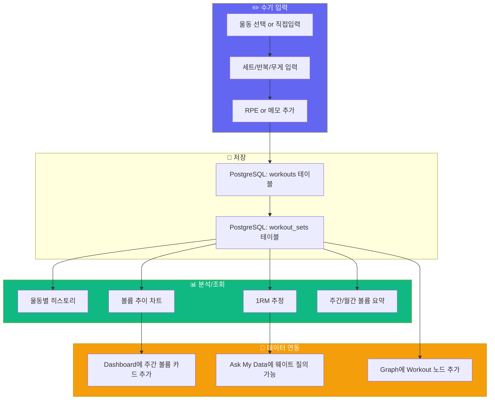

# 구상: 웨이트 운동 수기 입력 페이지

> Garmin에는 없는 웨이트/근력 운동을 직접 입력하고, 볼륨/1RM 추이를 추적하는 기능.

---

## 1. 전체 개념



---

## 2. 운동 종류 관리: 고정 목록 + 기타 직접입력

### 2-1. 기본 운동 목록 (약 30개)

**가슴 (7)**
```
벤치프레스, 인클라인 벤치프레스, 덤벨 프레스, 인클라인 덤벨 프레스,
덤벨 플라이, 케이블 플라이, 체스트 프레스 머신
```

**등 (7)**
```
데드리프트, 랙풀, 바벨로우, 덤벨로우, 풀업, 랫풀다운,
시티드 케이블 로우, 페이스풀
```

**어깨 (5)**
```
오버헤드 프레스, 덤벨 숄더 프레스, 사이드 레터럴 레이즈,
프론트 레이즈, 리어 델트 플라이
```

**하체 (7)**
```
스쿼트, 프론트 스쿼트, 불가리안 스플릿 스쿼트, 런지,
레그 프레스, 레그 익스텐션, 레그 컬, 힙 쓰러스트, 루마니안 데드리프트
```

**팔 (4)**
```
바벨 컬, 덤벨 컬, 해머 컬, 트라이셉스 푸시다운, 스컬크러셔
```

**코어 (2)**
```
플랭크, 행잉 레그 레이즈, 싯업
```

### 2-2. 입력 UI

```
┌────────────────────────────────────────────┐
│ 오늘의 웨이트 운등                          │
│ 2026-05-03 (일)                            │
├────────────────────────────────────────────┤
│                                            │
│  운등 *  [벤치프레스 ▼]  or  [기타 직접입력] │
│                                            │
│  ┌────────────────────────────────────┐    │
│  │ 세트 1  [ 5 ]회  [ 80 ]kg  [🗑️]   │    │
│  │ 세트 2  [ 5 ]회  [ 80 ]kg  [🗑️]   │    │
│  │ 세트 3  [ 4 ]회  [ 82.5]kg [🗑️]   │    │
│  │ 세트 4  [   ]회  [    ]kg [🗑️]   │    │
│  └────────────────────────────────────┘    │
│  [+ 세트 추가]                              │
│                                            │
│  RPE     [ 8 ] / 10                        │
│  메모    [______]                          │
│                                            │
│  볼륨: 1,210 kg (예상)                     │
│                                            │
│  [    다음 운등 추가    ]  [  저장  ]       │
│                                            │
├────────────────────────────────────────────┤
│ 📋 오늘 등록한 운등                         │
│ • 벤치프레스: 3세트 × 볼륨 1,210kg         │
│ • 스쿼트: 4세트 × 볼륨 3,600kg             │
└────────────────────────────────────────────┘
```

**기타 직접입력 플로우:**
```
[기타 직접입력] 클릭
→ 입력창 활성화: "울동명을 입력하세요"
→ 사용자 입력: "클린 앤 저크"
→ 목록에 추가되며 동시에 저장
→ 이후 모든 사용자가 "클린 앤 저크"를 볼 수 있음
```

> **논의 필요:** "기타"로 추가된 운등을 개인용만 할지, 전체 사용자 공유할지?
> - 개인용: 내 목록에만 나타남
> - 공유용: 모든 사용자가 볼 수 있음 (관리자 승인 없이)
> - **현재 구상: 공유용 (단순함), 단 너무 많아지면 인기순 정렬**

---

## 3. DB 스키마

```sql
-- 웨이트 운등 마스터 (기본 + 사용자 추가)
CREATE TABLE workout_exercises (
    id BIGSERIAL PRIMARY KEY,
    name VARCHAR(100) NOT NULL,
    category VARCHAR(50) NOT NULL,        -- CHEST / BACK / SHOULDER / LEGS / ARMS / CORE
    is_custom BOOLEAN NOT NULL DEFAULT FALSE,
    created_by_user_id BIGINT REFERENCES users(id),
    created_at TIMESTAMPTZ NOT NULL DEFAULT NOW(),
    UNIQUE (name)
);

-- 웨이트 운등 세션 (1일 1회 단위)
CREATE TABLE workout_sessions (
    id BIGSERIAL PRIMARY KEY,
    user_id BIGINT NOT NULL REFERENCES users(id) ON DELETE CASCADE,
    session_date DATE NOT NULL,
    title VARCHAR(255),                   -- "가슴/삼두", "등/이두" 등
    duration_minutes INTEGER,
    total_volume_kg NUMERIC(12,2),        -- 자동 계산
    note TEXT,
    created_at TIMESTAMPTZ NOT NULL DEFAULT NOW(),
    updated_at TIMESTAMPTZ NOT NULL DEFAULT NOW()
);

-- 개별 운등 기록 (세션 내 운동별)
CREATE TABLE workout_entries (
    id BIGSERIAL PRIMARY KEY,
    session_id BIGINT NOT NULL REFERENCES workout_sessions(id) ON DELETE CASCADE,
    exercise_id BIGINT NOT NULL REFERENCES workout_exercises(id),
    order_index INTEGER NOT NULL DEFAULT 0,
    note TEXT,
    created_at TIMESTAMPTZ NOT NULL DEFAULT NOW()
);

-- 세트 상세
CREATE TABLE workout_sets (
    id BIGSERIAL PRIMARY KEY,
    entry_id BIGINT NOT NULL REFERENCES workout_entries(id) ON DELETE CASCADE,
    set_number INTEGER NOT NULL,
    reps INTEGER NOT NULL,
    weight_kg NUMERIC(8,2) NOT NULL,
    rpe INTEGER,                          -- 1~10, 선택
    is_done BOOLEAN NOT NULL DEFAULT TRUE,
    created_at TIMESTAMPTZ NOT NULL DEFAULT NOW(),
    UNIQUE (entry_id, set_number)
);
```

---

## 4. 화면 구성 (메뉴: `/workouts`)

### 4-1. 운등 입력 탭 (`/workouts/log`)

| 구성 요소 | 설명 |
|----------|------|
| 날짜 선택 | 기본값 오늘, 과거 날짜도 입력 가능 |
| 운등 선택 | Select Dropdown (카테고리 그룹화) + "기타 직접입력" |
| 세트 입력 | 동적 행 추가/삭제, 회/무게 |
| RPE | 선택 (1~10 슬라이더) |
| 메모 | 텍스트, 선택 |
| 실시간 볼륨 | 세트×반복×무게 합계 표시 |
| 오늘 등록 목록 | 화면 하단에 이미 등록한 운등 요약 |

### 4-2. 히스토리 탭 (`/workouts/history`)

```
┌────────────────────────────────────────────┐
│ 웨이트 운등 히스토리                         │
├────────────────────────────────────────────┤
│ [📅 2026-04-01 ~ 2026-05-03]  [🔍 운등명]  │
├────────────────────────────────────────────┤
│ 5월 3일 (토)                               │
│ ┌────────────────────────────────────────┐ │
│ │ 💪 가슴/삼두  ·  45분  ·  볼륨 8,200kg │ │
│ │   벤치프레스  5×5 @ 80kg               │ │
│ │   인클라인 프레스  3×10 @ 20kg         │ │
│ └────────────────────────────────────────┘ │
│ 5월 1일 (목)                               │
│ ┌────────────────────────────────────────┐ │
│ │ 🦵 하체  ·  60분  ·  볼륨 12,000kg    │ │
│ │   스쿼트  5×5 @ 100kg                  │ │
│ │   루마니안 DL  3×8 @ 80kg              │ │
│ └────────────────────────────────────────┘ │
└────────────────────────────────────────────┘
```

### 4-3. 운등별 추이 탭 (`/workouts/progress`)

```
┌────────────────────────────────────────────┐
│ [벤치프레스 ▼]  추이                        │
├────────────────────────────────────────────┤
│                                            │
│     📈 1RM 추정 추이 (LineChart)            │
│     3개월간 변화                            │
│                                            │
├────────────────────────────────────────────┤
│     📊 볼륨 추이 (BarChart)                 │
│     주간 총 볼륨                            │
│                                            │
├────────────────────────────────────────────┤
│ 최근 기록                                   │
│ 5/3  5×5 @ 80kg  →  1RM 추정: 93kg        │
│ 4/28 5×5 @ 77.5kg →  1RM 추정: 90kg       │
│ 4/21 5×5 @ 75kg  →  1RM 추정: 87kg        │
│                                            │
│ PR: 100kg (3/15)                           │
└────────────────────────────────────────────┘
```

**1RM 추정 공식 (Epley):**
```
1RM = weight × (1 + reps / 30)
```

---

## 5. 사이드바 메뉴 변경

```
현재:
  Dashboard
  Data Sources
  Activities
  Health Timeline
  Personal Graph
  Ask My Data
  Insights
  Goals
  Settings

변경 후:
  Dashboard
  Data Sources
  Activities          ← 여기서 Garmin / 수기 입력 탭 분리
  Health Timeline
  💪 Workouts         ← 신규! (웨이트 수기 입력)
  Personal Graph
  Ask My Data
  Insights
  Goals
  Settings
```

또는 `Activities` 안에 탭으로 통합:
```
/activities
  ├── [Garmin Activities] 탭
  └── [Weight Workouts] 탭
```

> **의견:** 별도 메뉴가 낫습니다. Garmin은 "유산소/기록" 느낌, 웨이트는 "근력/볼륨" 느낌이라 성격이 다름.

---

## 6. 기존 시스템 연동

| 연동 대상 | 내용 |
|----------|------|
| **Dashboard** | 주간 웨이트 볼륨 카드 추가, 총 볼륨 vs 지난주 비교 |
| **Graph (Neo4j)** | `Workout` 노드 타입 추가, `PERFORMED` 관계로 Person과 연결 |
| **Ask My Data** | "이번 주 웨이트 볼륨은 적절해?" 같은 질의 가능 |
| **Insights** | 웨이트 관련 인사이트 카테고리 추가 |

---

## 7. 구현 범위 (MVP 내)

| 기능 | 포함 | 비고 |
|------|------|------|
| 운동 입력 (세트/반복/무게) | ✅ | |
| 고정 목록 + 기타 직접입력 | ✅ | |
| 히스토리 조회 | ✅ | |
| 볼륨 계산 | ✅ | 자동 |
| 1RM 추정 차트 | ✅ | Epley 공식 |
| RPE 입력 | ✅ | 선택 |
| 타이머/휴식 | ❌ | Phase 2 |
| 운동 템플릿 저장 | ❌ | Phase 2 |
| 사진 첨부 | ❌ | Phase 2 |
| 소셜 공유 | ❌ | Phase 2 |

---

## 8. 예상 작업량

| 작업 | 예상 시간 |
|------|----------|
| DB 스키마 (3개 테이블) + Flyway 마이그레이션 | 2시간 |
| Backend: Entity, Repository, Service, Controller | 4시간 |
| Frontend: 운등 입력 폼 | 4시간 |
| Frontend: 히스토리 목록 | 2시간 |
| Frontend: 추이 차트 (1RM + 볼륨) | 3시간 |
| Sidebar 메뉴 추가 + 라우팅 | 1시간 |
| Dashboard 연동 (볼륨 카드) | 2시간 |
| Graph 연동 (Workout 노드) | 2시간 |
| **합계** | **~20시간** |
