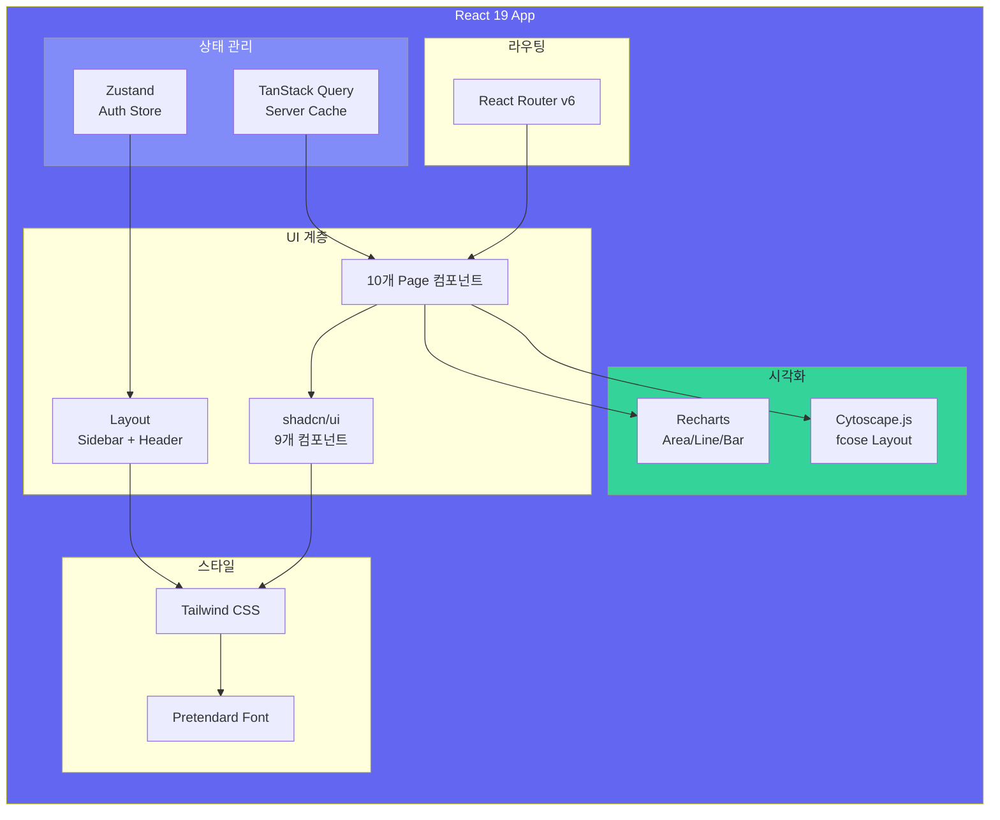

# 🛠 기술 스택

## 전체 스택 비교표

| 영역 | 기술 | 버전 | 선택 이유 |
|------|------|------|----------|
| **Backend** | Spring Boot | 3.3 | Java 생태계 표준, JPA/Security 완벽 지원 |
| | Java | 21 | LTS, var, Virtual Threads 대비 |
| | JJWT | 0.12.5 | 최신 JWT 표준 |
| | OpenAI Java SDK | 0.13.0 | 공식 SDK, 안정적 |
| | Neo4j Java Driver | 5.20.0 | Neo4j 공식 드라이버 |
| | Flyway | 10.x | DB 마이그레이션 자동화 |
| **Frontend** | React | 19 | 최신 React, 개선된 성능 |
| | TypeScript | 5.5 | 타입 안전성 |
| | Vite | 5.3 | 빠른 빌드, HMR |
| | Tailwind CSS | 3.4 | 유틸리티 기반, 빠른 UI 개발 |
| | shadcn/ui | custom | Radix 기반, 커스터마이징 용이 |
| | Recharts | 2.12 | React 친화적 차트 라이브러리 |
| | Cytoscape.js | 3.26 | 네트워크 그래프 시각화 (fcose 레이아웃) |
| | TanStack Query | 5.51 | 서버 상태 관리, 캐싱 |
| | Zustand | 4.5 | 가벼운 클라이언트 상태 관리 |
| **Database** | PostgreSQL | 16 | 안정적 RDB, JSONB 지원 |
| | pgvector | latest | 벡터 검색 확장 |
| | Neo4j | 5 Community | 그래프 데이터베이스 표준 |
| **Infra** | Docker Compose | 3.9 | 로컬/운영 환경 통일 |
| | nginx | alpine | 가벼운 정적 파일 서버 |
| **Font** | Pretendard | Variable | 한글/영문 가독성 최고 |

---

## Frontend 의존성 트리

---

## Backend 레이어 구조

```mermaid
flowchart TB
    subgraph SpringBoot["Spring Boot 3.3 Application"]
        direction TB

        subgraph ControllerLayer["Controller Layer<br/>(10개)"]
            C1[AuthController]
            C2[DashboardController]
            C3[AskController]
            C4[GraphController]
            C5[DataSourceController]
            C6[ActivityController]
            C7[HealthController]
            C8[InsightController]
            C9[GoalController]
            C10[LlmProviderController]
        end

        subgraph ServiceLayer["Service Layer<br/>(12개)"]
            S1[AuthService]
            S2[DashboardService]
            S3[AskService]
            S4[GraphService]
            S5[GraphProjectorService]
            S6[MockDataService]
            S7[ActivityService]
            S8[HealthService]
            S9[InsightService]
            S10[GoalService]
            S11[LlmProviderService]
            S12[DataSourceService]
        end

        subgraph RepositoryLayer["Repository Layer<br/>(11개)"]
            R1[UserRepository]
            R2[ActivityRepository]
            R3[GarminDailyHealthMetricRepository]
            R4[GarminSleepSessionRepository]
            R5[InsightRepository]
            R6[InsightEvidenceRepository]
            R7[GoalRepository]
            R8[LlmProviderRepository]
            R9[ProviderConnectionRepository]
            R10[QuestionRepository]
            R11[GraphNodeMappingRepository]
        end

        subgraph DomainLayer["Domain Layer<br/>(12개 Entity)"]
            E1[User]
            E2[Activity]
            E3[GarminActivityLap]
            E4[GarminDailyHealthMetric]
            E5[GarminSleepSession]
            E6[Goal]
            E7[LlmProvider]
            E8[Question]
            E9[Insight]
            E10[InsightEvidence]
            E11[ProviderConnection]
            E12[GraphNodeMapping]
        end

        subgraph SecurityLayer["Security Layer"]
            JWT1[JwtUtil]
            JWT2[JwtAuthenticationFilter]
            JWT3[SecurityConfig]
        end
    end

    ControllerLayer --> ServiceLayer
    ServiceLayer --> RepositoryLayer
    RepositoryLayer --> DomainLayer
    SecurityLayer --> ControllerLayer

    style SpringBoot fill:#10b981,color:#fff
    style ControllerLayer fill:#34d399,color:#1f2937
    style ServiceLayer fill:#6ee7b7,color:#1f2937
    style RepositoryLayer fill:#a7f3d0,color:#1f2937
    style DomainLayer fill:#d1fae5,color:#1f2937
    style SecurityLayer fill:#f43f5e,color:#fff
```

